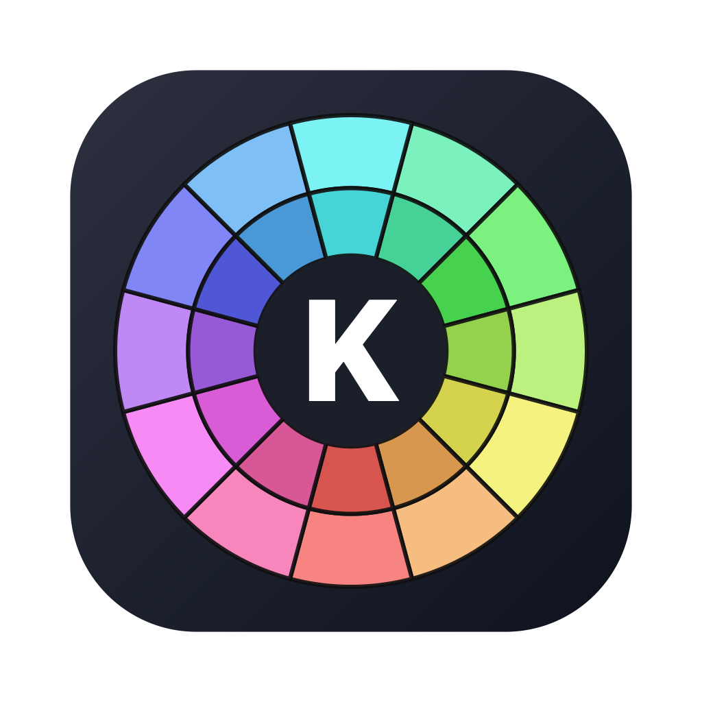
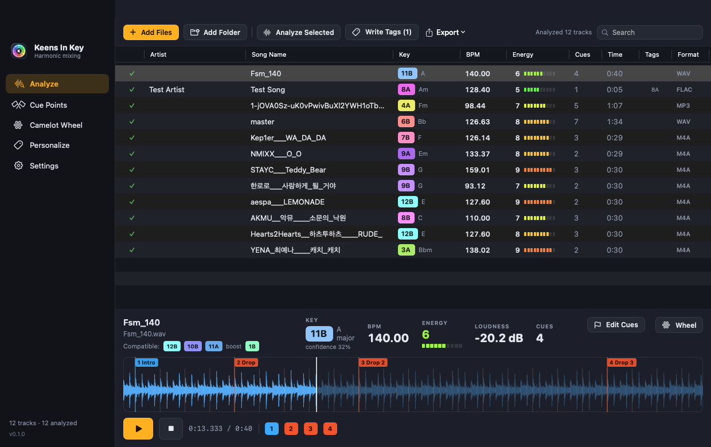
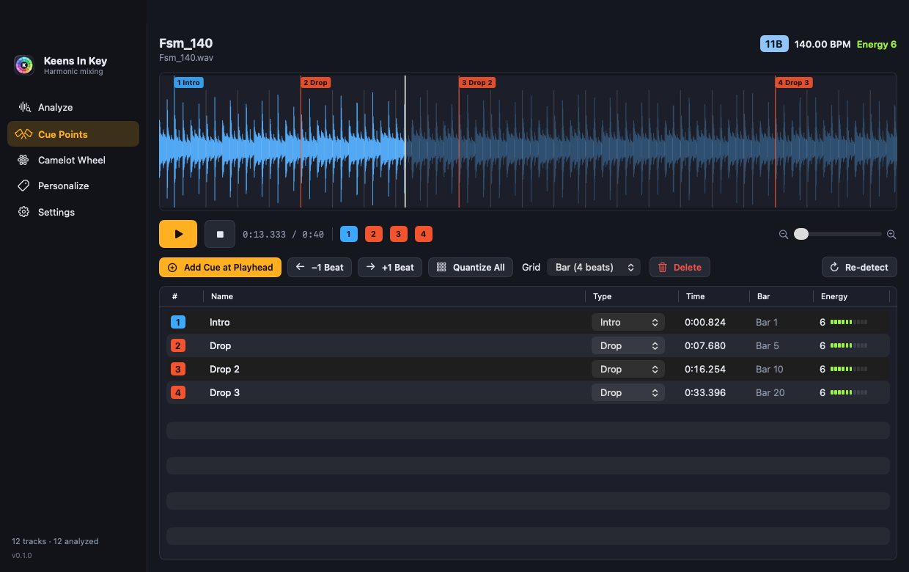
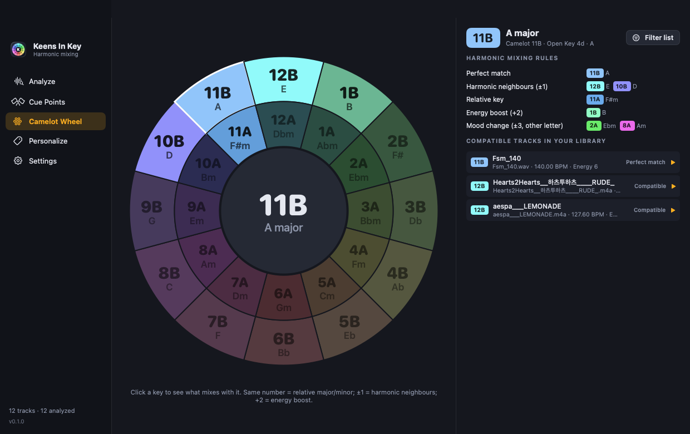
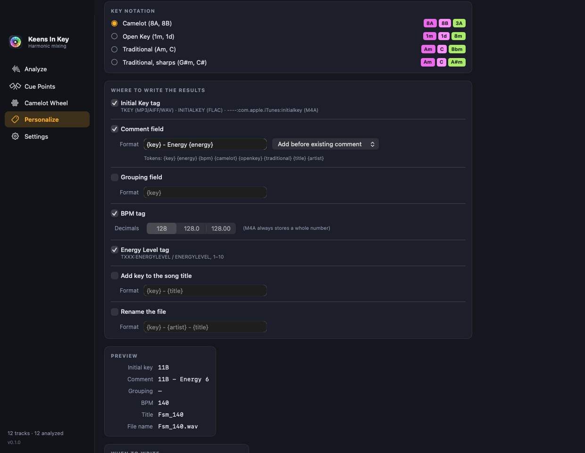
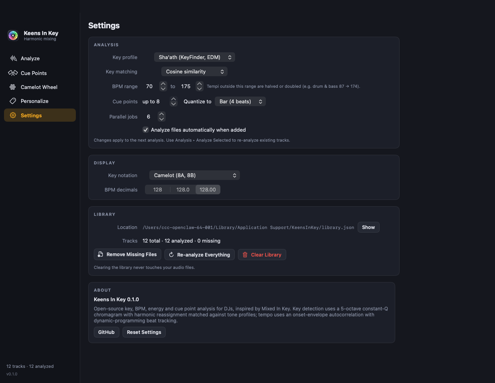

<p align="center">
  
</p>

<h1 align="center">Keens In Key</h1>

<p align="center">
  Key · BPM · Energy · Cue points — harmonic mixing analysis for DJs, on your Mac.<br>
  An open-source take on <em>Mixed In Key</em>, built natively in Swift.
</p>

<p align="center">
  <a href="https://github.com/garam-with-ccc/keens-in-key/releases/latest">Download for macOS</a> ·
  <a href="#features">Features</a> ·
  <a href="#how-the-analysis-works">How it works</a> ·
  <a href="#command-line">Command line</a> ·
  <a href="#한국어">한국어</a>
</p>

---



## Features

| Area | What you get |
| --- | --- |
| **Key detection** | Musical key of every track, shown as **Camelot** (8A/8B), **Open Key** (1m/1d) or **traditional** (Am/C) notation with a colour-coded badge, confidence and tuning offset. |
| **BPM & beat grid** | Precise tempo (two decimals), beat positions and downbeats. Tempo range folding (e.g. 87 → 174 for drum & bass) is configurable. |
| **Energy level** | 1–10 energy rating from loudness, bass weight, brightness and rhythmic drive, like Mixed In Key's energy level. |
| **Cue points** | Up to 8 cue points at section changes (Intro / Verse / Build / Drop / Break / Outro), **quantized** to the beat grid (beat, bar, 4 or 8 bars). Edit, nudge, drag and re-quantize them on a zoomable waveform. |
| **Camelot wheel** | Interactive wheel highlighting harmonic neighbours, relative keys, energy-boost and mood-change mixes, plus the compatible tracks already in your library. |
| **Tag writing** | Writes key / BPM / energy into **MP3, AIFF, WAV (ID3v2), FLAC (Vorbis comments) and M4A/AAC (iTunes atoms, incl. `initialkey`)** files without re-encoding. Personalize where the result goes: Initial Key tag, comment, grouping, title prefix, file name. |
| **Export** | CSV, **rekordbox XML** (with tempo grid and hot cues) and M3U playlists. |
| **Batch** | Drag & drop files or folders; parallel analysis (about a second per track on Apple silicon); results persist in a local library. |

Supported input: MP3, M4A/AAC/ALAC, WAV, AIFF, FLAC, CAF (anything Core Audio decodes).

## Install

1. Download `KeensInKey-<version>.dmg` (or `.zip`) from the [latest release](https://github.com/garam-with-ccc/keens-in-key/releases/latest).
2. Drag **Keens In Key.app** into `Applications`.
3. The app is ad-hoc signed (no Apple Developer ID), so on first launch macOS Gatekeeper will complain. Either right-click the app → **Open** → **Open**, or run:

   ```bash
   xattr -dr com.apple.quarantine "/Applications/KeensInKey.app"
   ```

Requires macOS 14 Sonoma or later (Apple silicon or Intel).

## Screenshots

| Cue points | Camelot wheel |
| --- | --- |
|  |  |

| Personalize | Settings |
| --- | --- |
|  |  |

## How the analysis works

Everything is implemented in Swift on top of Accelerate (vDSP) and AVFoundation — no external DSP libraries.

* **Key** — audio is resampled to 11.025 kHz and analysed with 16k-point Blackman-windowed FFTs. A constant-Q style spectral kernel over C1–B5 folds the spectrum into a 12-bin chromagram, with HPCP-style harmonic reassignment to counter the classic "dominant key" bias and an automatic tuning estimate (±40 cents). The summed chroma is matched against 24 rotated tone profiles (Sha'ath/KeyFinder by default; Krumhansl-Kessler, Temperley and Essentia's EDMA profiles are selectable).
* **Tempo** — a spectral-flux onset envelope (40 log-spaced bands, 172 frames/s, level-aware log compression so kicks outweigh hi-hats) is autocorrelated, weighted with a log-normal tempo prior and scored with harmonic support at 2× and 4× the period (suppresses 3:2 and 4:3 errors from dotted rhythms). The period is refined over bar-length lags, beats are tracked with Ellis' dynamic-programming beat tracker, and the final BPM is fitted to the beat sequence for two-decimal precision.
* **Downbeats & cues** — beat-level energy and chroma features are compared bar-to-bar; the beat phase with the largest bar-boundary novelty becomes the downbeat, and novelty peaks on the bar grid (with a phrase-alignment bonus) become cue points, labelled from the energy of the surrounding sections.
* **Energy** — combines integrated and short-term loudness, bass ratio, brightness, onset spikiness and tempo periodicity into a 1–10 score.

Accuracy was checked against Essentia's `KeyExtractor` / `RhythmExtractor2013` on 177 K-pop, pop and AI-generated tracks: on the 100 K-pop previews the key is exact 70% of the time and Camelot-compatible 88%, and BPM agrees within 2% on 86% (Essentia's own two key profiles agree with each other only 85% of the time). Details and methodology in [docs/ACCURACY.md](docs/ACCURACY.md).

## Command line

The app bundle ships with a CLI (`Keens In Key.app/Contents/MacOS/kik`), also built by `swift build --product kik`:

```bash
kik analyze --json ~/Music/DJ/*.mp3          # key / bpm / energy / cues per file
kik write --grouping ~/Music/DJ/*.mp3         # analyse and write tags
kik tags track.m4a                            # show stored tags
kik export --rekordbox rekordbox.xml ~/Music/DJ
kik compat 8A                                 # compatible keys
```

## Build from source

```bash
git clone https://github.com/garam-with-ccc/keens-in-key.git
cd keens-in-key
swift test                # unit tests (key mapping, ID3/FLAC/MP4 round trips)
./Scripts/build-app.sh    # → dist/KeensInKey.app, .zip and .dmg
```

Xcode 16 / Swift 5.10 or newer. The project is a plain Swift package: `KeensInKeyCore` (DSP, tags, export), `KeensInKey` (SwiftUI app) and `kik` (CLI).

## Roadmap / ideas

* Serato / Traktor cue-point export, Rekordbox database sync
* Live mode: analyse the current deck in real time
* Mashup helper: pick harmonically compatible stems
* Batch "energy set" builder and playlist ordering by Camelot distance

## 한국어

**Keens In Key**는 Mixed In Key와 같은 방식으로 음악 파일의 **키(Camelot/Open Key/전통 표기), BPM, 에너지 레벨, 큐 포인트**를 분석하고, 그 결과를 MP3·M4A·WAV·AIFF·FLAC 태그에 기록하는 macOS 네이티브 앱입니다.

* 파일이나 폴더를 드래그하면 자동으로 분석됩니다 (트랙당 약 1초).
* 큐 포인트는 비트 그리드에 **퀀타이즈**되며(비트/마디/4마디/8마디), 파형 위에서 드래그·나지·재퀀타이즈할 수 있습니다.
* Camelot Wheel 탭에서 호환 키와 라이브러리 내 호환 트랙을 확인할 수 있습니다.
* Personalize 탭에서 태그 기록 방식(Initial Key, 코멘트 형식, 그룹, 제목 접두어, 파일명)을 설정합니다.
* CSV / rekordbox XML / M3U로 내보낼 수 있습니다.

설치: 릴리즈에서 DMG를 받아 응용 프로그램 폴더로 옮긴 뒤, 처음 실행 시 우클릭 → 열기 (개발자 서명이 없는 앱입니다).

## License

MIT — see [LICENSE](LICENSE). "Mixed In Key" is a trademark of Mixed In Key LLC; this project is not affiliated with it.
